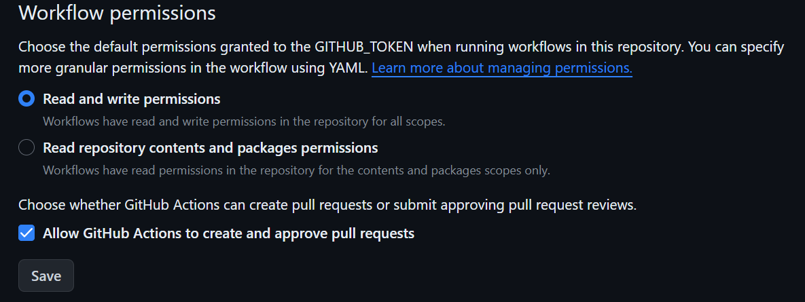

# React Project Template

This project was created with
[Create React App](https://create-react-app.dev/). To get
acquainted and configure additional features
[refer to guide](https://create-react-app.dev/docs/getting-started/).

## Getting Started

To run this React Project Template on your local machine, follow these steps:

### Clone the Repository

```bash
git clone https://github.com/KHARKIVSKA-KURKUMA/react-project-template.git
```

Or just tap the `«Use this template»` button and choose
`«Create a new repository»` option

### Install Dependencies

```bash
npm install
```

### Run the Application

```bash
npm start
```

<a id="permissions"></a>

## Permissions

After the repository is created, go to the repository settings (`Settings` > `Actions` > `General`).
Go to the end of the page in the `Workflow permissions` section, select the `Read and write permissions` option and check the box, click `Save`. As shown in the picture below.



<a id="deploy"></a>

## Deploy

Change `<YOUR_REPO_NAME>` to your repo name in `index.js`

```js
<BrowserRouter basename="/<YOUR_REPO_NAME>">
  <App />
</BrowserRouter>
```

In the `package.json` file, replace `<YOUR_REPO_NAME>` with your repository name and `<YOUR_GITHUB_USERNAME>` with your username

```json
"homepage": "https://<YOUR_GITHUB_USERNAME>.github.io/<YOUR_REPO_NAME>/",
```

The production version of the project will automatically be built, and
deployed to GitHub Pages in `gh-pages` branch every time the `main` branch
is updated.

Next, you need to go to the settings of the GitHub repository (`Settings` >
`Pages`) and set the distribution of the production version of files with `Deploy from a branch` from `/root` directory and `gh-pages` branch, if this was not done automatically. You can see it on the image below.


### Deployment status

The deployment status of the latest commit is displayed with an icon next to its
ID.

-  - the project is being built and deployed.
-  - deployment completed successfully.
-  - an error occurred during linting, build, or deployment.

More detailed information about the status can be viewed by clicking on the
icon and in the drop-down window, follow the link `Details`.

### Live page

The page requires a couple of minutes to load, the live page can be viewed at the
address `https://<YOUR_GITHUB_USERNAME>.github.io/<REPO_NAME>/`. For example, here is a link
to a live version for this repository

https://kharkivska-kurkuma.github.io/react-project-template/

If a blank page opens, make sure there are no errors in the `Console` tab
related to incorrect paths to the files of the project (**404**). If you have such errors double check [Deploy Section](#deploy) and [Permissions Section](#permissions)
