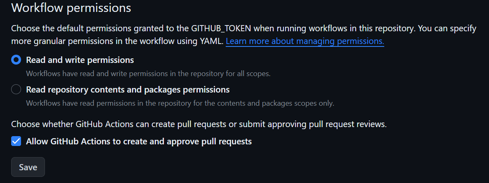
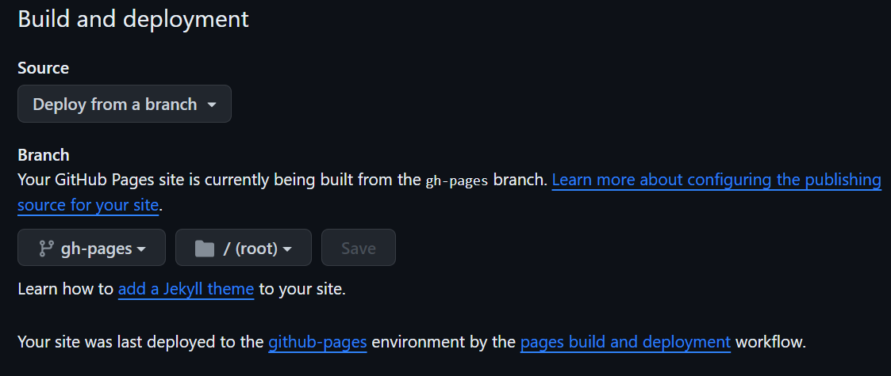

# React Project Template

Цей проєкт був зібраний за допомогою
[Create React App](https://create-react-app.dev/). Щоб ознайомитись та налаштувати додатковий функціонал
[перейдіть до документації](https://create-react-app.dev/docs/getting-started/).

## Початок

Для запуску цього React Project Template на вашому локальному комп'ютері, виконайте ці дії:

### Склонуйте цей репозиторій

```bash
git clone https://github.com/KHARKIVSKA-KURKUMA/react-project-template.git
```

Або натисніть `«Use this template»` і виберіть
`«Create a new repository»`

### Встановіть залежності

```bash
npm install
```

### Запустіть додаток

```bash
npm start
```

<a id="permissions-section"></a>

## Дозволи (Permissions)

Після того як репозиторій створено, перейдіть в налаштування репозиторію (`Settings` > `Actions` > `General`) .
Перейдіть вкінець сторінки в секції `Workflow permissions` виберіть опцію `Read and write permissions` і поставте прапорець, натисніть `Save`. Так як це показано на картинці нижче.



<a id="deployment-section"></a>

## Розгортання (Deploy)

Замініть `<YOUR_REPO_NAME>` на назву вашого репозиторія в файлі `index.js`

```js
<BrowserRouter basename="/<YOUR_REPO_NAME>">
  <App />
</BrowserRouter>
```

В файлі `package.json` замініть `<YOUR_REPO_NAME>` на назву вашого репозиторія і `<YOUR_GITHUB_USERNAME>` на ваше ім'я користувача

```json
"homepage": "https://<YOUR_GITHUB_USERNAME>.github.io/<YOUR_REPO_NAME>/",
```

Продакшн-версія проєкту буде автоматично створена та розгортатиметься на GitHub page, в гілці `gh-pages` кожного разу, коли гілка `main` оновлюється.

Далі потрібно зайти в налаштування репозиторію GitHub (`Settings` >
`Pages`) і встановити розповсюдження робочої версії файлів за допомогою `Deploy from a branch` з папки `/root` та гілки `gh-pages`, якщо це не було зроблено автоматично. Ви можете побачити це на зображенні нижче.



### Статус Розгортання

Статус розгортання останнього коміту відображається разом з іконкою

-  - проєкт в процесі розгортання.
-  - розгортання завершено успішно.
-  - сталася помилка під час розгортання.

Більш детальну інформацію про статус можна переглянути, натиснувши на іконку
і у випадному вікні перейти за посиланням `Details`.

### Жива сторінка

Через деякий час, як правило, пару хвилин, сторінку можна буде переглянути за
адресою, `https://<YOUR_GITHUB_USERNAME>.github.io/<REPO_NAME>/`. Наприклад, ось посилання
до живої версії для цього репозиторію

https://kharkivska-kurkuma.github.io/react-project-template/

Якщо відкривається порожня сторінка, переконайтеся, що на вкладці `Console` немає помилок
пов'язаних з неправильними шляхами до файлів проєкту (**404**). Якщо помилки існують перевірте шляхи описані в секції [Deploy](#deployment-section) і [Permissions](#permissions-section)
